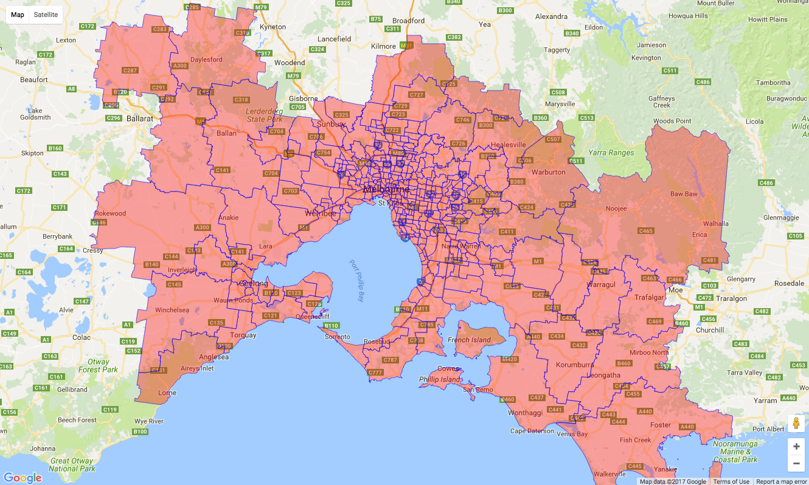
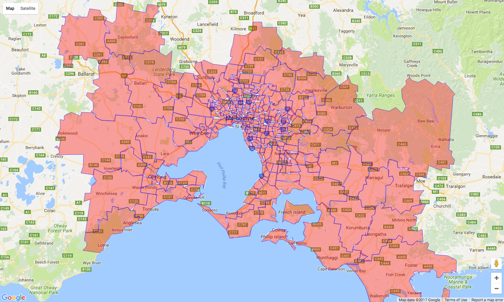

```{r libraries}
library(microbenchmark)
library(spatialdatatable)
library(googleway)
library(data.table)
library(geosphere) ## for compariing results

```

## Haversine Distance

```{r dtHaversine}


n <- 10000
set.seed(20170511)
lats <- -90:90
lons <- -180:180
dt <- data.table::data.table(lat1 = sample(lats, size = n, replace = T),
                             lon1 = sample(lons, size = n, replace = T),
                             lat2 = sample(lats, size = n, replace = T),
                             lon2 = sample(lons, size = n, replace = T))

dt1 <- copy(dt)
dt2 <- copy(dt)

microbenchmark(
	sdt = { dt1[, dtDistance := dtHaversine(lat1, lon1, lat2, lon2)]  },
	geo = { dt2[, geoDistance := distHaversine(matrix(c(lon1, lat1), ncol = 2),
                                   matrix(c(lon2, lat2), ncol = 2))]  }
)

dt1
```


## Comparison of distance calculations

```{r distanceComparison}
n <- 10000
set.seed(20170511)
lats <- -90:90
lons <- -180:180
dt <- data.table::data.table(lat1 = sample(lats, size = n, replace = T),
                             lon1 = sample(lons, size = n, replace = T),
                             lat2 = sample(lats, size = n, replace = T),
                             lon2 = sample(lons, size = n, replace = T))

dt[, idx := .I]
dt[, distEuclid := dtEuclidean(lat1, lon1, lat2, lon2)]
dt[, distHaversine := dtHaversine(lat1, lon1, lat2, lon2)]
dt[, distCosine := dtCosine(lat1, lon1, lat2, lon2)]

```

## Bearing

```{r bearing}

n <- 10000
set.seed(20170511)
lats <- -90:90
lons <- -180:180
dt <- data.table::data.table(lat1 = sample(lats, size = n, replace = T),
                             lon1 = sample(lons, size = n, replace = T),
                             lat2 = sample(lats, size = n, replace = T),
                             lon2 = sample(lons, size = n, replace = T))

dt1 <- copy(dt)
dt2 <- copy(dt)

microbenchmark(
	sdt = { dt1[, dtBearing := dtBearing(lat1, lon1, lat2, lon2)]  },
	geo = { dt2[, geoBearing := bearing(matrix(c(lon1, lat1), ncol = 2),
                                   matrix(c(lon2, lat2), ncol = 2))]  }
)

dt1

```

## Midpoint

```{r midpoint}

n <- 10000
set.seed(20170511)
lats <- -90:90
lons <- -180:180
dt <- data.table::data.table(lat1 = sample(lats, size = n, replace = T),
                             lon1 = sample(lons, size = n, replace = T),
                             lat2 = sample(lats, size = n, replace = T),
                             lon2 = sample(lons, size = n, replace = T))

dt[, c("midLat", "midLon") := dtMidpoint(lat1, lon1, lat2, lon2)] 
dt
```


## Simplifying Polylines

```{r}

dt_melbourne <- copy(googleway::melbourne)
setDT(dt_melbourne)
object.size(dt_melbourne)

## first simplification with a 10 metre tolerance
dt_melbourne[, polyline := SimplifyPolyline(polyline, distanceTolerance = 10, type = "complex"),
						 by = .(polygonId, pathId)]
object.size(dt_melbourne)
```

```
google_map(key = mapKey) %>%
  add_polygons(data = dt_melbourne, polyline = "polyline", id = "polygonId")
```


```{r}
dt_melbourne <- copy(googleway::melbourne)
setDT(dt_melbourne)

dt_melbourne[, polyline := SimplifyPolyline(polyline, distanceTolerance = 100, type = "complex"),
						 by = .(polygonId, pathId)]

object.size(dt_melbourne)

```

```
google_map(key = mapKey) %>%
  add_polygons(data = dt_melbourne, polyline = "polyline", id = "polygonId")
```


```{r}
dt_melbourne <- copy(googleway::melbourne)
setDT(dt_melbourne)

dt_melbourne[, polyline := SimplifyPolyline(polyline, distanceTolerance = 1000, type = "complex"),
						 by = .(polygonId, pathId)]

object.size(dt_melbourne)

```

```
google_map(key = mapKey) %>%
  add_polygons(data = dt_melbourne, polyline = "polyline", id = "polygonId")
```



## Nearest Points


```{r nearestPoints}

library(spatialdatatable)
library(googleway)
library(data.table)

dt_stops <- as.data.table(tram_stops)
dt_route <- as.data.table(tram_route)

dt_nearest <- dtNearestPoints(dt1 = copy(dt_route),
															dt2 = copy(dt_stops),
															dt1Coords = c("shape_pt_lat", "shape_pt_lon"),
															dt2Coords = c("stop_lat","stop_lon"))


## create a polyline between the joined pairs of coordinates
# 
# dt_nearest[, polyline := gepaf::encodePolyline(data.frame(c(dt_nearest[, shape_pt_lat.x], dt_nearest[, stop_lat.y]),
# 																													c(dt_nearest[, shape_pt_lon.x], dt_nearest[, stop_lon.y])))]


pl <- sapply(1:nrow(dt_nearest), function(x){
	lats <- dt_nearest[x, c(shape_pt_lat.x, stop_lat.y)]
	lons <- dt_nearest[x, c(shape_pt_lon.x, stop_lon.y)]
	polyline = encode_pl(lat = lats,lon = lons)
})


dt_nearest[, polyline := pl ]


# mapKey <- symbolix.utils::mapKey()

# google_map(key = mapKey) %>%
# 	#add_circles(data = dt_route, lat = "shape_pt_lat", lon = "shape_pt_lon", fill_colour = "#FF00FF", stroke_weight = 0) %>%
# 	add_markers(data = dt_stops, lat = "stop_lat", lon = "stop_lon") %>%
# 	add_polylines(data = dt_route, lat = "shape_pt_lat", lon = "shape_pt_lon") %>%
# 	add_circles(data = dt_nearest, lat = "shape_pt_lat.x", lon = "shape_pt_lon.x", stroke_weight = 0, radius = 20) %>%
# 	add_polylines(data = dt_nearest, polyline = "polyline", stroke_colour = "#000000")
# 	#add_circles(data = dt_stops, lat = "stop_lat", lon = "stop_lon", fill_colour = "#00FF00", stroke_weight = 0) 


```

